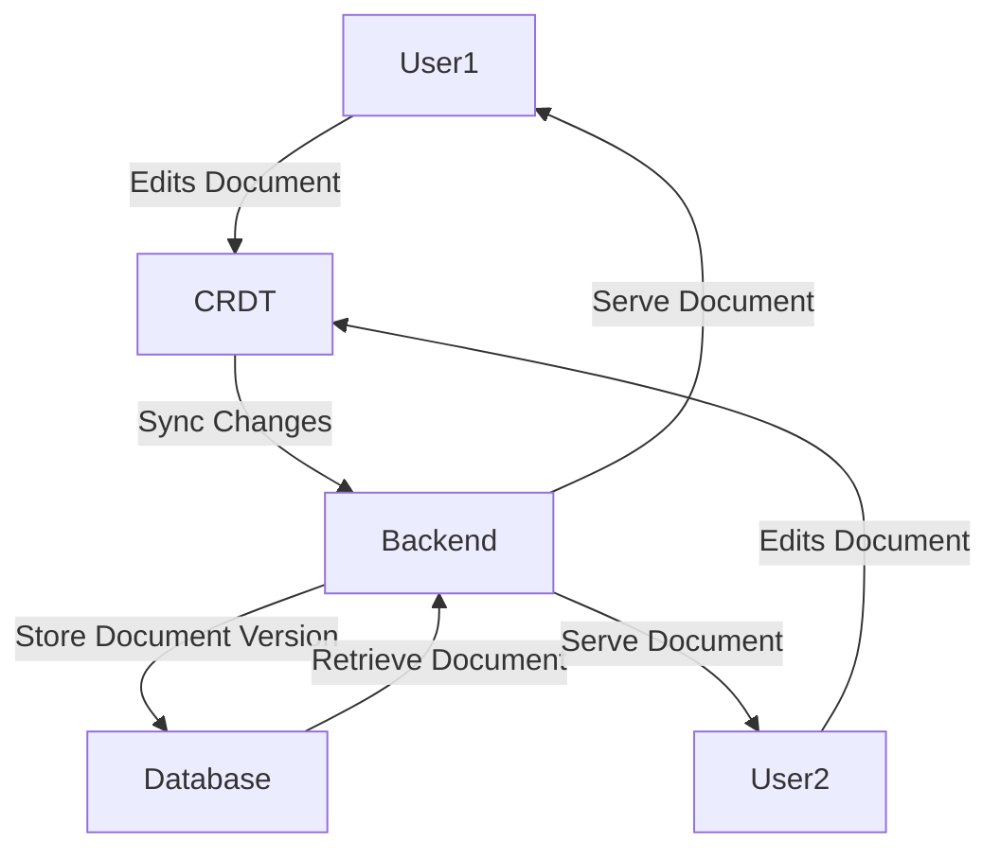
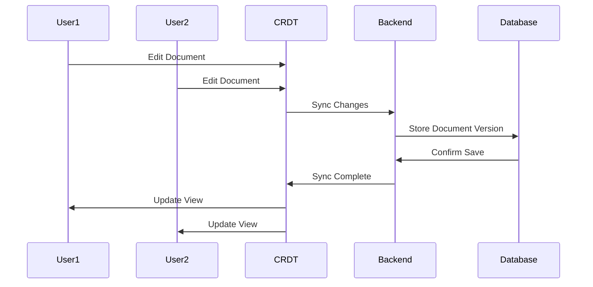
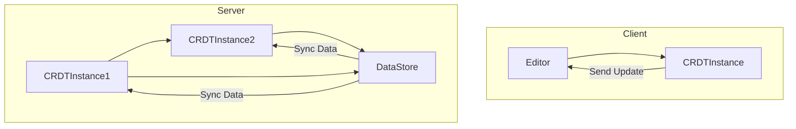
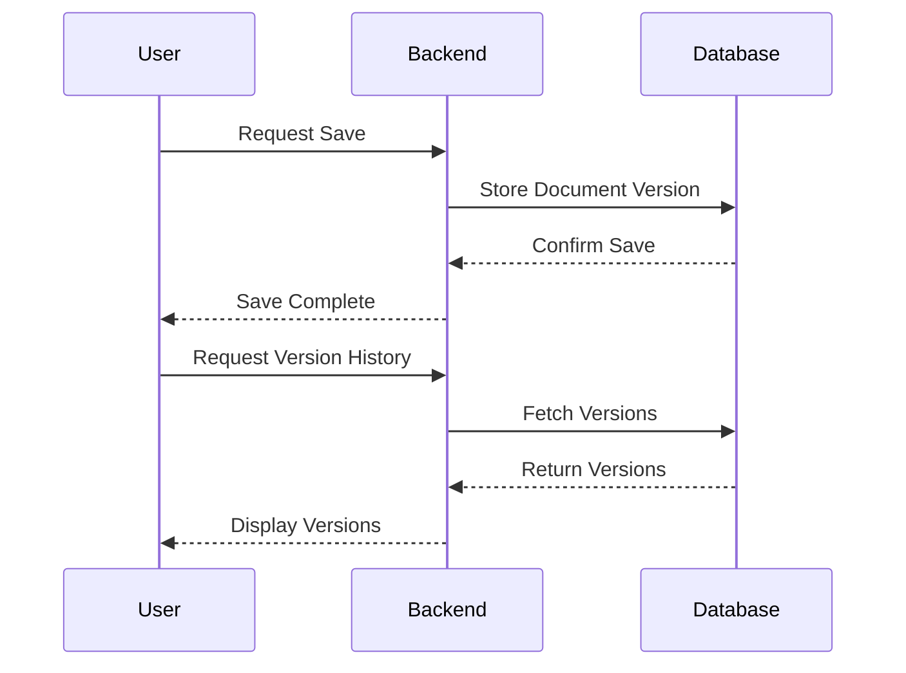

Here's a specification template in Markdown format for building a Google Docs-like application, including features and some Mermaid graphs for CRDT sync.

### Google Docs Clone Specification

## Introduction
This document provides an overview of the features, architecture, and implementation details for building a Google Docs-like collaborative editing application.

## Features

### 1. **Real-Time Collaborative Editing**
   - Multiple users can edit the same document simultaneously.
   - Changes are reflected in real-time across all users’ screens.
   - Conflict resolution using CRDT (Conflict-Free Replicated Data Type).

### 2. **User Authentication**
   - Users must sign in to create, edit, or view documents.
   - OAuth 2.0-based authentication via Google, Facebook, or other third-party providers.

### 3. **Document Versioning**
   - Track the entire version history of the document.
   - Users can revert to any previous version of the document.

### 4. **Document Sharing and Permissions**
   - Share documents with other users via links.
   - Permission levels: Viewer, Editor, Owner.
   - Public or restricted access options.

### 5. **Rich Text Editor**
   - Support for formatting (bold, italic, underline, headings).
   - Bullets and numbered lists.
   - Insert images, tables, and links.
   - Real-time cursors indicating where others are editing.

### 6. **Offline Editing**
   - Users can continue editing offline, with changes synced once reconnected.

### 7. **Commenting and Suggestions**
   - Users can leave comments on specific text.
   - Suggest mode for editing, where changes must be accepted by the owner.

### 8. **Export and Import**
   - Export documents in formats like PDF, DOCX, and TXT.
   - Import from popular formats.

## Technology Stack

- **Frontend**: React with a rich text editor like Lexical or Slate.
- **Backend**: Node.js with NestJS for an enterprise-level architecture.
- **Database**: RavenDB for handling document storage.
- **Collaboration**: CRDTs for real-time synchronization (Automerge).
- **Authentication**: OAuth 2.0 for user sign-in.
- **Deployment**: Docker containers for easy deployment and scaling.

## Data Flow Diagram

## CRDT Sync Flow

## Real-Time Collaborative Editing (CRDT Architecture)

## Document Versioning Flow

## Conclusion
This document outlines the main features and architecture of the Google Docs clone application. The use of CRDTs ensures that real-time collaboration is smooth, conflict-free, and scalable. Further details will be added as the project progresses.
